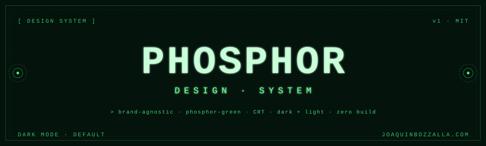

<div align="center">

<picture>
  <source media="(prefers-color-scheme: dark)" srcset="docs/banner-dark.svg">
  <source media="(prefers-color-scheme: light)" srcset="docs/banner-light.svg">
  
</picture>

# Phosphor Design System

**A phosphor-green editorial design system inspired by old CRT terminals.**
Black screens, glowing green type, hand-drawn line geometries, and restrained, machine-like motion.
Modern and minimal in structure; retro in texture.

[](./LICENSE)
[](#tech)
[](#whats-inside)
[](https://joaquinbozzalla.com)

[**design-system.html**](./design-system.html) &nbsp;·&nbsp; [**editorial-content.html**](./editorial-content.html) &nbsp;·&nbsp; [**DESIGN.md**](./DESIGN.md) &nbsp;·&nbsp; [**AGENTS.md**](./AGENTS.md)

</div>

---

## Live demo

🟢 **[joaquinbozzalla.github.io/phosphor-design-system](https://joaquinbozzalla.github.io/phosphor-design-system/)**

Or open the HTML files directly in a browser — no build step, no dependencies.

- [`design-system.html`](./design-system.html) — the full system: color, type, space, components, motion, imagery, voice.
- [`editorial-content.html`](./editorial-content.html) — the system applied to long-form content: links, tables, images, video, code, callouts.

Both pages share the same theme toggle; the state persists across them via `localStorage`.

> [!TIP]
> Serve the folder with any static server (`python3 -m http.server`, `npx serve`, etc.) so the fonts load over `http://` instead of `file://`.

---

## What's inside

```
.
├── design-system.html          # the system, documented
├── editorial-content.html      # the system, applied to editorial content
├── colors_and_type.css         # all tokens + @font-face + base type + animations
├── illustrations/              # 8 SVG line-art motifs × 2 theme variants (*.svg + *-light.svg)
├── fonts/ibm-plex-mono/        # self-hosted primary mono (9 weights) + OFL.txt
├── export/                     # the same tokens as CSS / SCSS / JS / JSON
├── DESIGN.md                   # design rules, voice, anti-patterns — the source of truth
└── AGENTS.md                   # how to feed this system to Claude Code, Codex, and other LLMs
```

---

## Use it in your own project

### Option A — drop the whole folder in

Copy the directory, link `colors_and_type.css`, set `data-theme="dark"` (or `"light"`) on `<html>`, and start building with the tokens.

```html
<link rel="stylesheet" href="phosphor-design-system/colors_and_type.css">
<html data-theme="dark">
```

### Option B — tokens only

If you already have a stylesheet, grab the format you want from [`export/`](./export):

| File | For |
|---|---|
| [`export/tokens.css`](./export/tokens.css) | CSS custom properties (drop-in) |
| [`export/tokens.scss`](./export/tokens.scss) | Sass maps + helpers |
| [`export/tokens.js`](./export/tokens.js) | ESM modules (React, styled-components, vanilla JS) |
| [`export/tokens.json`](./export/tokens.json) | W3C DTCG (Style Dictionary, Tokens Studio) |

> [!IMPORTANT]
> Read [`DESIGN.md`](./DESIGN.md) before you start — it holds the rules, the voice, and the anti-patterns (no emoji, no purple gradients, sharp corners, brighten-don't-scale).

---

## Use it with LLMs (Claude Code, Codex, Cursor…)

This system was designed to be machine-readable: `DESIGN.md` is structured, `colors_and_type.css` is the literal source of truth, and `export/tokens.json` is the W3C-DTCG canonical form. Point your coding agent at this repo and it will follow the rules.

**The two files an agent needs to read first:** [`DESIGN.md`](./DESIGN.md) (rules, voice, anti-patterns) and [`AGENTS.md`](./AGENTS.md) (how to apply them).

### Claude Code

```bash
# Inside your project — clone the system somewhere reachable
git clone https://github.com/joaquinbozzalla/phosphor-design-system.git
cd phosphor-design-system

# Launch Claude Code in the system's directory and ask it to read the rules
claude
> /memory add ./DESIGN.md
> /memory add ./AGENTS.md
> Now build me a hero section that follows this system.
```

Or reference the system from inside another project by adding to your `CLAUDE.md`:

```md
This project uses the Phosphor Design System (https://github.com/joaquinbozzalla/phosphor-design-system).
Before generating any UI, read ./vendor/phosphor-design-system/DESIGN.md and ./vendor/phosphor-design-system/AGENTS.md.
Use the tokens from ./vendor/phosphor-design-system/colors_and_type.css. Never hardcode colors or spacing.
```

### Codex / Cursor / other agents

Either:

1. **Clone into the project** (`./vendor/phosphor-design-system/`) and add a rule file (`.cursorrules`, `AGENTS.md`, or the equivalent) pointing the agent at `DESIGN.md` + `colors_and_type.css`.
2. **Paste the tokens directly** into the agent's context: `export/tokens.json` is the most compact, fully-typed form (W3C DTCG).

A minimal prompt that works across agents:

> You are building a UI in the Phosphor Design System. Read `DESIGN.md` (rules + anti-patterns) and `AGENTS.md` (application notes). Use the tokens in `colors_and_type.css`/`export/tokens.css` exclusively — no hardcoded values. Match the voice and the negative space of `design-system.html` and `editorial-content.html`.

See [`AGENTS.md`](./AGENTS.md) for the full agent-facing brief (token glossary, what to copy from existing pages, the do/don't list).

---

## Tech

Vanilla HTML + CSS. No framework, no build, no dependencies. Themed via a single `data-theme` attribute and CSS custom properties.

<details>
<summary><b>Browser support</b></summary>

Modern evergreen browsers (Chrome, Firefox, Safari, Edge). Uses `color-mix()`, CSS custom properties, `backdrop-filter`, and `@font-face` — all baseline-supported.

</details>

<details>
<summary><b>Anti-patterns (the short list — see DESIGN.md §9)</b></summary>

- No emoji, no filled/duotone icons, no hand-drawn humans
- No bluish-purple gradients or body-background gradients
- No soft pebble corners — buttons 8&nbsp;px max, modals 14&nbsp;px max
- No Gaussian drop-shadows in dark mode; no loud scanlines
- Brighten, don't scale, on hover

</details>

---

## Credits

- **IBM Plex Mono** — the single typeface across the system, self-hosted under [`fonts/ibm-plex-mono/`](./fonts/ibm-plex-mono). SIL Open Font License (see [`fonts/ibm-plex-mono/OFL.txt`](./fonts/ibm-plex-mono/OFL.txt)).

---

## License

[MIT](./LICENSE) for the code, CSS, tokens, and illustrations. IBM Plex Mono keeps its OFL.

---

<div align="center">

Made by [**Joaquín Bozzalla**](https://joaquinbozzalla.com) with [**Open Design**](https://github.com/nexu-io/open-design) &nbsp;·&nbsp; [github.com/joaquinbozzalla](https://github.com/joaquinbozzalla)

`> one thousand no's for every yes`

</div>
